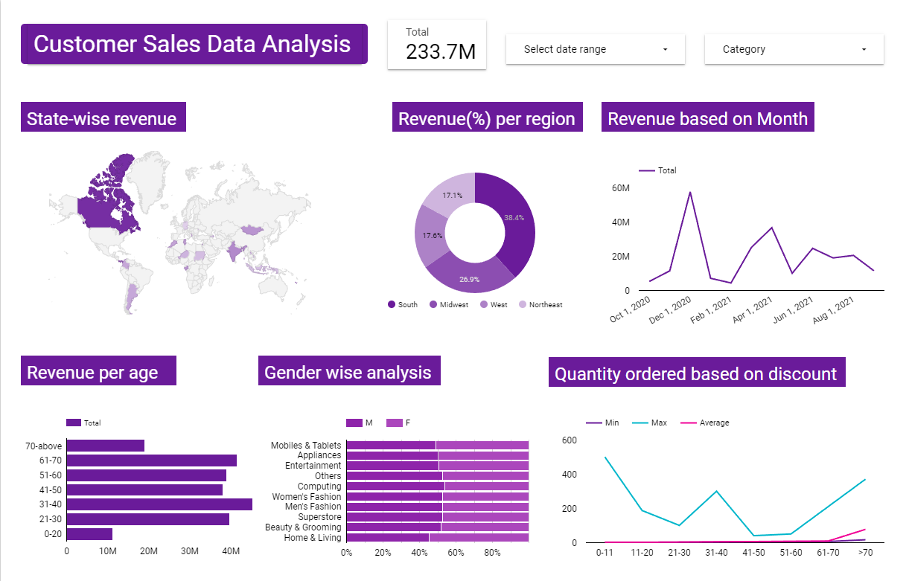

# Customer Sales Data Analysis and Prediction
Analytics of a customer sales dataset. Includes data visualization and sales prediction using machine learning.  

<h2> Visualization </h2>
View Report: https://datastudio.google.com/reporting/8d8f0ff8-b3b2-4ec2-8556-f095e695c55e  
Tool: Looker Studio (Google Data Studio)  

<h2> Order quantity prediction </h2>
Utilized relevant features to predict customer's order quantity of particular product.
Prediction model: XGBoost Regressor  
Result:  
|Test R Squared value | 0.9860726072926651 |  
